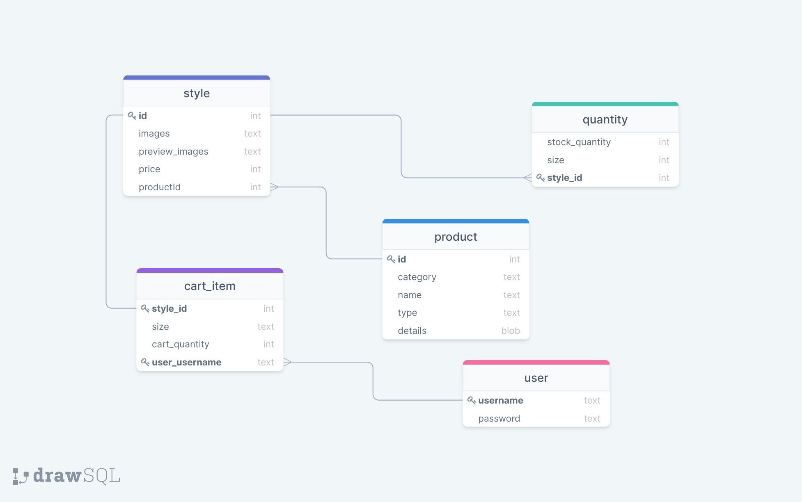
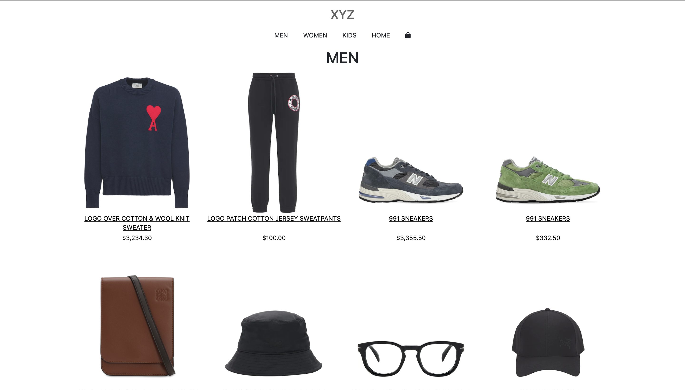
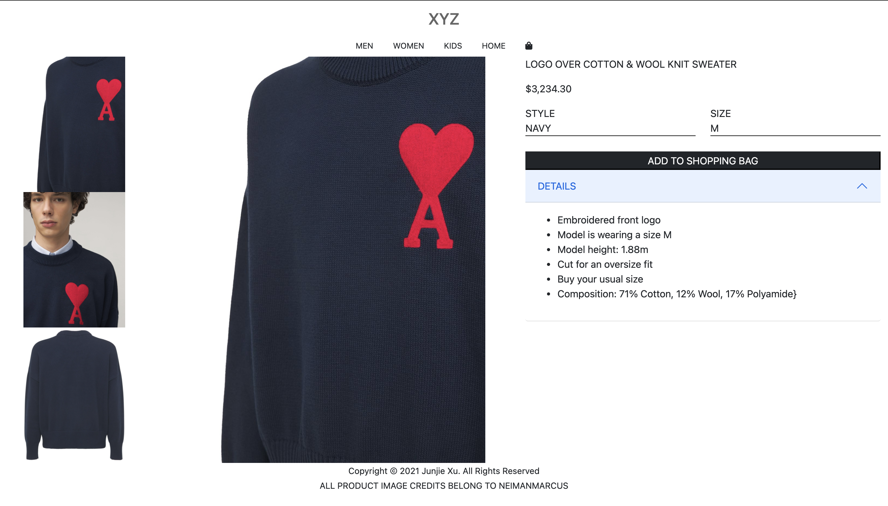
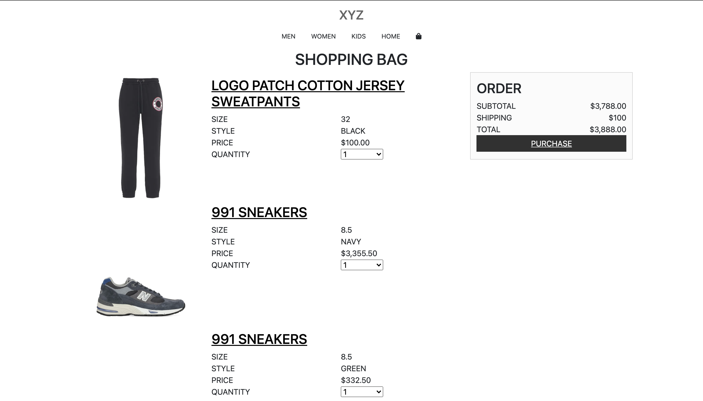
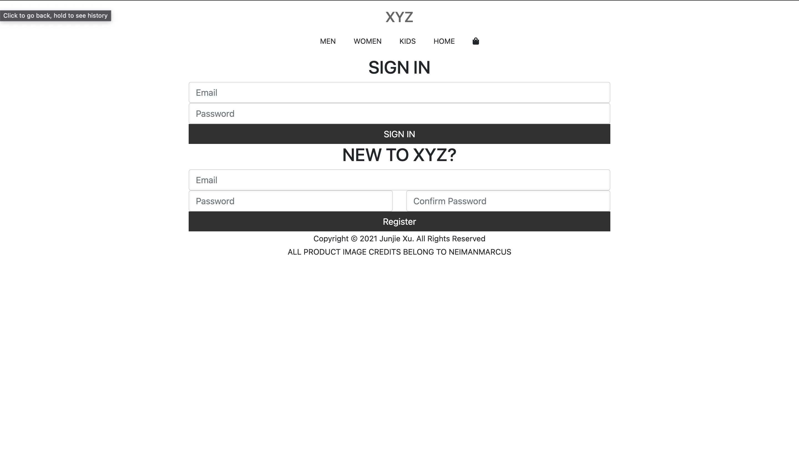
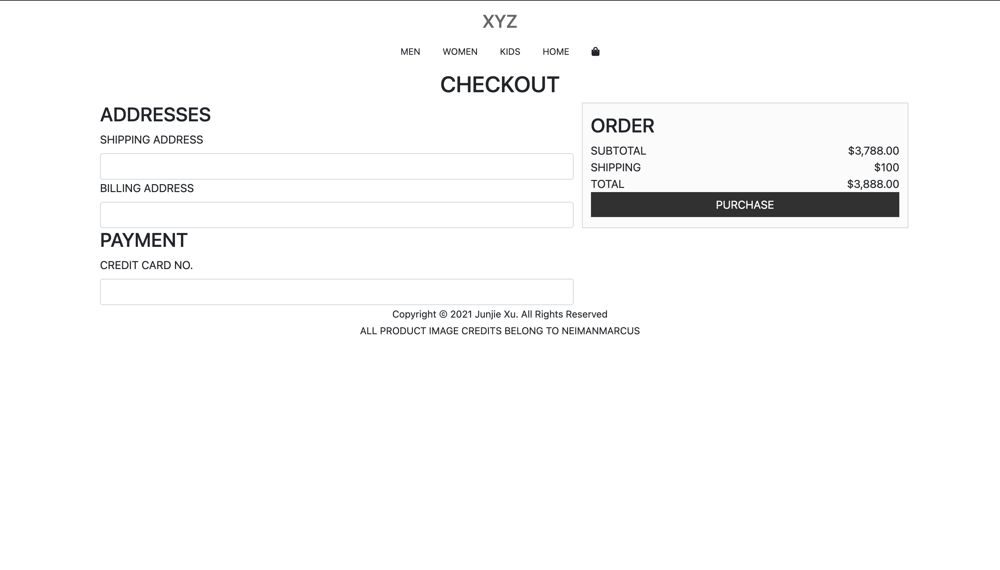

# Case Study

## Description
XYZ is an e-commerce web application for a clothing retailer. A user is able to browse products, sign up for an account, log in to his/her account, add items to a shopping bag, and checkout.

## Table of Contents
1. [User-Stories](#User-Stories)
2. [Challenges](#Challenges)
3. [Installation](#Installation)
4. [Tech Stack](#Tech-Stack)
5. [Credits](#Credits)
6. [Demo](#Demo-Images)

## User-Stories
* As a user who is not logged in, I can browse all products of all types so that I know what items are for sale
* As a user who is not logged in, I can view the details of a specific product so that I can learn about the product
* As a user who is not logged in, I can browse reviews
* As a user who is not logged in, I can view the images of a specific product so that I can see what the product looks like from multiple angles
* As a user who is not logged in, I can view different style of a product if applicable so that I can select a different color of the same product
* As a user who is not logged in, I can view all the sizes of a product so that I can select a size that I prefer
* As a user who is not logged in, I can register for an account so that I can add products to my shopping bag
* As a user who is logged in, I can add an item to my shopping bag so that I can save products that I intend to purchase
* As a user who is logged in, I can add a review for an item
* As a user who is logged in, I can check out my shopping bag so that I receive the product in exchange for payment
* As a user who is logged in, I can update the quantity of an item in my shopping bag so that I can buy more than one if more than one of the product is in stock
* As a user who is logged in, I can remove an item from my shopping bag so that I can buy only the products I want

## Challenges
* Implementing Composite Key with JPA - A composite(compound) key is an identifier that is uses two or more columns. Two of the tables in my database did not logically require any numerical key. Instead, they relied on the combinations of two separate foreign keys. To implement such a feature in JPA, two solutions exists. I could implement a surrogate key to fulfill the id column requirement. But, my solution used the @EmbeddedId annotation to specify a primary key object in addition to a field specifying a mapping. I was able to fetch any record in the database using the composite key rather than a single id field.
* Determining if a User is Already Logged In - To verify if my user has already logged in, I needed to keep track of their session. With Passport.js, the convention is to store the user's sessionId in a database and verify the user's sessionId every time a request is sent. With Spring MVC and Apache Tomcat, I learned that the HTTPSession stores attributes in memory by default. I also had to set a cookie containing the sessionId to enforce authentication.

## Installation
1. Install Apache Tomcat
2. Clone `https://github.com/xdynasty/case-study.git` 
3. Create database named "xyz"
4. Run MainRunner to populate database
5. Run application on server

## Tech-Stack
* Spring MVC
* Eclipselink
* Axios
* Bcrypt
* AWS S3 Buckets
* MySQL
* Bootstrap
* jQuery
* Maven
* JSP
* Apache Tomcat

## Credits
Product images rights belong to Neiman Marcus.

## Demo-Images

Schema Diagram

 

Index

 

Products

 

Product

 

Bag

 

Account

 

Checkout

 

