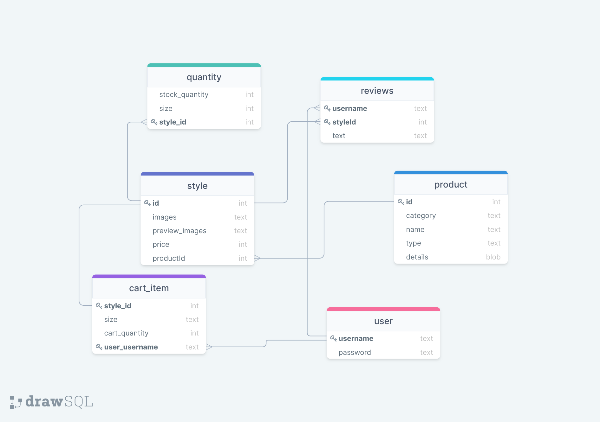

# Case Study

## Description
XYZ is an e-commerce web application that sells apparel. A user is able to browse products, sign up for an account, log in to his/her account, add items to a shopping bag, and checkout.

## Table of Contents
1. [User-Stories](#User-Stories)
2. [Tech Stack](#Tech-Stack)
3. [Credits](#Credits)
4. [Demo](#Demo)

## User-Stories
* As a user who is not logged in, I can browse all products of all types
* As a user who is not logged in, I can view the details of a specific product
* As a user who is not logged in, I can view the images of a specific product
* As a user who is not logged in, I can view different style of a product if applicable
* As a user who is not logged in, I can view all the sizes of a product
* As a user who is not logged in, I can register for an account
* As a user who is logged in, I can add an item to my shopping bag
* As a user who is logged in, I can check out my shopping bag
* As a user who is logged in, I can update the quantity of an item in my shopping bag
* As a user who is logged in, I can remove an item from my shopping bag

## Tech-Stack
* Spring MVC
* Eclipselink
* Axios
* Bcrypt
* AWS S3 Buckets
* MySQL
* Bootstrap
* jQuery
* Maven
* JSP

## Credits
Product images rights belong to Neiman Marcus.

## Demo Images

Entity Relationship Diagram

 

Index

 

Products

 

Product

 

Bag

 

Account

 

Checkout

 

